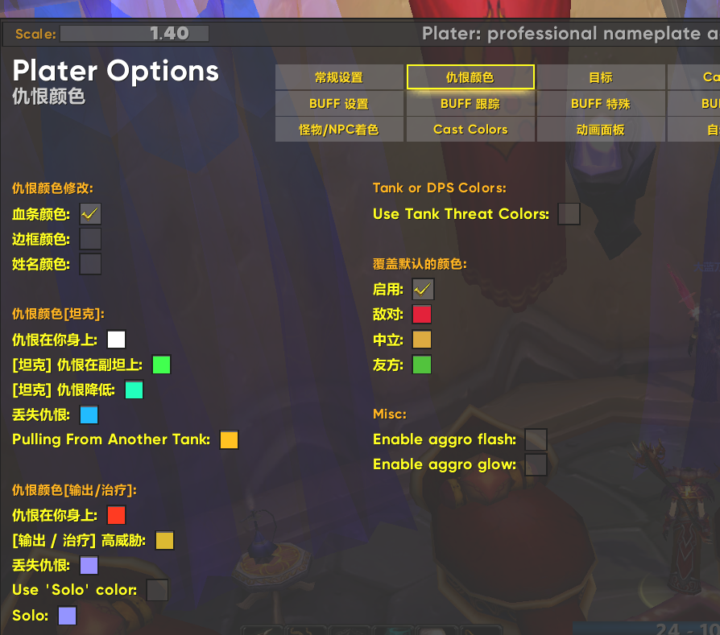
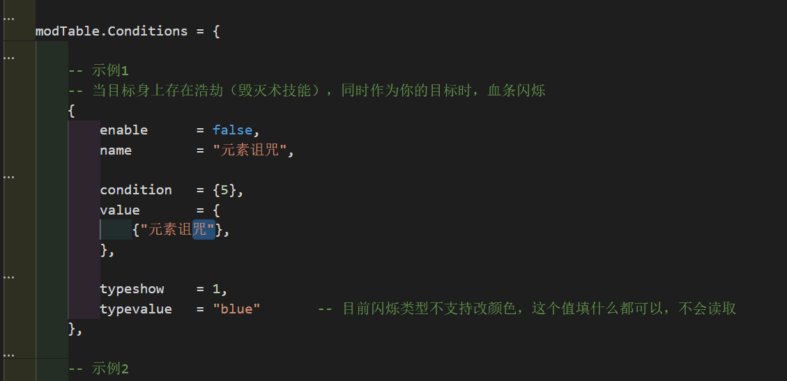

# 使用说明

首先颜色覆盖优先级别 从上到有优先级逐渐降低

仇恨变色（团本）
自定义变色
斩杀变色
**目标变色**
**plater自定义变色**
反斩杀变色
**指定怪物变色**
**有指定debuff变色**
无buff目标变色

## 仇恨变色（团本）

## 自定义变色

可以直接在mod的代码里面添加 格式如下 

## 斩杀变色

## 目标变色

## plater自定义变色

## 反斩杀变色

## 指定怪物变色

## 有指定debuff/buff变色

## 无buff目标变色